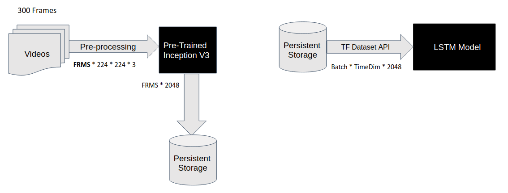

<a id="top"></a>
# TFRecords Tutorial

**Contents**<br>
[What are TFRecords](#what-are-tfrecords)<br>
[Use Case: DeepFake Detection](#deepfake-detection) <br>
[Creating TFRecords](#creating-tfrecords)<br>
[Extracting TFRecords](#extracting-tfrecords)<br>
[Using TFRecords in a Keras Training Pipeline](#using-tfrecords-in-a-keras-training-pipeline)


## What are TFRecords

TF Records are Tensorflow's recommended and own binary storage format. When the training datasets are large, using TF Records would lead to a much better performance in feeding data to the model and thus leading to shorter training times. More about this on [Tensorflow.org](https://www.tensorflow.org/tutorials/load_data/tfrecord)

References to Well-written articles on TFRecords:
1. http://warmspringwinds.github.io/tensorflow/tf-slim/2016/12/21/tfrecords-guide/
2. https://medium.com/mostly-ai/tensorflow-records-what-they-are-and-how-to-use-them-c46bc4bbb564

## DeepFake-Detection

The code snippets in the next sections are taken from my other project related to DeepFake Detection [More on Description and Dataset](https://www.kaggle.com/c/deepfake-detection-challenge). [Repo](https://github.com/VivekReddy98/DeepFake-Detection) The task at hand is pretty straightforward. Given a video, classify it into Real of Fake. But the Problem was the Dataset Size. It was roughly 300 GB. So, a Efficient Data Pipeline was necessary.

This was the source of reference on how i choose to approach the problem [Link:](https://ieeexplore.ieee.org/document/8639163). To Roughly Summarize, A pre-trained Inception V3 (CNN) is used to extract frame level features and are then fed to a LSTM.



So, I planned to convert each of the videos (FRMS*X*Y*3) into (FRMS*2048). I've fed these videos to Pre-trained Inception V3 through a single step of forward propagation. Then, I've saved them as tfrecord format and these tfrecord files are used for training phase by the LSTM Network.

## Creating TFRecords

Using TFRecords Essentially consists of two steps.
1) Converting any Input data format to a single .tfrecord format. This is not trivial becuase serialization has to be done manually.
2) Then Use TF Data API to decode and apply any data pre-processing techniques.

You can look at [src.video2tfrecordCustom.TFRecordGenerator](https://github.com/VivekReddy98/DeepFake-Detection/blob/70cc4edc5a234fd4823ef205d67cd7084bcad1a3/src/video2tfrecordCustom.py#L110) class for a comprehensive overview of the functionality.

For brevity, I'll just be focussing on TFRecord Conversion Method here.

```python
def save_video_as_tf_records_ylabels(self, file, label, split):

    # Pre-checks before reading a video file
    tfrecords_filename = os.path.join(self.OUT_PATH, file.split('.')[0] + "_" + label + "_" + split + '.tfrecords')
    check_filename = os.path.join(self.OUT_PATH, file.split('.')[0])
    file_exists = glob.glob(check_filename+"_*.tfrecords")
    if file_exists:
        print("{0} file aready exists".format(tfrecords_filename))
        return 0
    file_path = os.path.join(self.SRC_PATH, file)

    try:
        cap = cv2.VideoCapture(file_path) 
        frameCount = int(cap.get(cv2.CAP_PROP_FRAME_COUNT))
        frameWidth = int(cap.get(cv2.CAP_PROP_FRAME_WIDTH))
        frameHeight = int(cap.get(cv2.CAP_PROP_FRAME_HEIGHT))
        if label == "FAKE":
            N_FRMS_PER_SAMPLE = self.N_FRMS_PER_SAMPLE_FAKE
        else:
            N_FRMS_PER_SAMPLE = self.N_FRMS_PER_SAMPLE_REAL

        # Allocate a Buffer to store extracted data from the Video File
        buf = np.empty((N_FRMS_PER_SAMPLE, self.WIDTH, self.HEIGHT, 3), np.dtype('float32'))

        if (frameCount < N_FRMS_PER_SAMPLE):
            print("Framecount too less to extract for file: " + tfrecords_filename + " frameCount: " + frameCount)
            return 0
        
        # Load the Video File into a Buffer
        fc = 0
        while (fc < N_FRMS_PER_SAMPLE):
            ret, frame = cap.read()
            frame = cv2.cvtColor(frame, cv2.COLOR_BGR2RGB)
            frame = self.central_crop(frame, 0.875)
            frame = cv2.resize(frame, (299, 299), interpolation = cv2.INTER_AREA)
            buf[fc] = tf.keras.applications.inception_v3.preprocess_input(frame)
            fc += 1
        buf.astype("float32")

        # Forward Pass through Inception V3 Pre-Trained Network, Output Shape: NUM_FRMS * 2048
        predictions = self.CNN_VECTORIZER.predict(buf)
        predictions = predictions.astype('float32') 

        
        # Converting into TF Records  
        options = tf.python_io.TFRecordOptions(tf.python_io.TFRecordCompressionType.GZIP) # Gzip Compression
        writer = tf.python_io.TFRecordWriter(tfrecords_filename, options=options)

        if label == "FAKE":
            y_label = np.array([1, 0], dtype=np.int64)
        else:
            y_label = np.array([0, 1], dtype=np.int64)


        img_raw = predictions.tostring() # Convert to Bytes
        labels_raw = y_label.tostring() # Convert to Bytes

        # By Converting a ND array into a Stream of Bytes, You'll loose the information of Shape and Datatype.
        # So, it's a good practice to save Shape Info. DataType info is fixed for "float32" at the decoder end. 
        # If a plain RGB format is used without any normalization, standardization or any pre-processing 
        #                               you might want to to "int8", which could greatly reduce the memory footprint.
        example = tf.train.Example(features=tf.train.Features(
                                feature={'vector_size': int64_feature(predictions.shape[1]),
                                        'batch_size': int64_feature(predictions.shape[0]),
                                        'image_raw': bytes_feature(img_raw),
                                        'labels_raw': bytes_feature(labels_raw)}))

        writer.write(example.SerializeToString()) # Write the Record
        writer.close()

    except Exception as e:
        print(str(e) + "for file: " + tfrecords_filename)

    return 1

def bytes_feature(value):
  return tf.train.Feature(bytes_list=tf.train.BytesList(value=[value]))

def int64_feature(value):
  return tf.train.Feature(int64_list=tf.train.Int64List(value=[value]))
```

## Extracting TFRecords

``` python
# Note: I was using Tf 1.12, For Newer Versions, Method Signature might change for dataset object
class TfRecordDecoder:
    def __init__(self, NUMFRAMES):
        self.NUMFRAMES = NUMFRAMES
        self.vector_size = 2048

    # Can Feed this Iterator to Training # https://github.com/tensorflow/tensorflow/issues/30646
    def _make_batch_iterator(self, tfrecord_files: List[str], batch_size, num_epochs, buffer_size):
        
        dataset = tf.data.TFRecordDataset(tfrecord_files, compression_type="GZIP") # Create a DataSet Object from TFRecord files
        # Shuffle as the name suggests shuffles the Data Before Training, although for perfect shuffling would 
        # require bufer_size to be full_size of the dataset, You could also set num_epochs
        # Ref: https://www.tensorflow.org/api_docs/python/tf/data/experimental/shuffle_and_repeat
        dataset = dataset.apply(tf.data.experimental.shuffle_and_repeat(buffer_size=buffer_size, count=num_epochs))
        dataset = dataset.map(self.decode_tfrecord, 4)  # Apply a function to every record.
        dataset = dataset.apply(tf.data.experimental.unbatch()) # Since, Every Record is 3 examples in my use case, i had to unbatch first
        dataset = dataset.batch(batch_size) # Choose a Batch_size for Training
        dataset = dataset.prefetch(5) # DataSet Would improves Latency, and would somewhat mitigate GPU Starvation Problem
        return dataset

    def decode_tfrecord(self, serialized_example):

        # Note: All these Would be Tensors at this point and as such you may not be able to use Numpy or any Python Native Constructs.
        parsed_data = tf.parse_single_example(serialized_example, features={
                                                      'vector_size': tf.FixedLenFeature([], tf.int64),
                                                      'batch_size' : tf.FixedLenFeature([], tf.int64),
                                                      'image_raw': tf.FixedLenFeature([], tf.string),
                                                      'labels_raw': tf.FixedLenFeature([], tf.string)})

        image = tf.decode_raw(parsed_data['image_raw'], tf.float32)
        annotation = tf.decode_raw(parsed_data['labels_raw'], tf.int64)
        vector_dimensions = tf.cast(parsed_data['vector_size'], tf.int32)
        batch_dim = tf.cast(parsed_data['batch_size'], tf.int32)

        # Snippet Down Below here might Seem a bit convoluted, but all it does is to convert a Record into 3 Training Examples. 
                # X: [240*2048], Y: [1*2]   ->  X: [3*80*2048], Y: [3*2] 
        image = tf.reshape(image, [batch_dim/self.NUMFRAMES, self.NUMFRAMES, self.vector_size])
        annotation = tf.reshape(annotation, (1,2))
        annotation = tf.ones([batch_dim/self.NUMFRAMES, 1], tf.int64) * annotation
        annotation = tf.cast(annotation, dtype=tf.int8)

        # Although if you were to store a single Training Example as a single Record then this should work fine
        # image = tf.reshape(image, [batch_dim, vector_dimensions])
        # annotation = tf.cast(annotation, dtype=tf.int8)

        return image, annotation

```

## Using TFRecords in a Keras Training Pipeline

```python
# Model Definition
class DeefFakeDetector:
    def __init__(self, frames):
        self.FRAMES = frames

    def build(self, name="INPUT_TENSOR"):
        input_val = Input(shape=(self.FRAMES, 2048), name=name) # Give a Name for the Input Placeholder
        x = LSTM(units=512, input_shape=(None, self.FRAMES, 2048), dropout=0.5)(input_val)
        x = Dense(units=256, activation='relu')(x)
        x = Dropout(rate=0.5)(x)
        preds = Dense(2, activation='softmax')(x)
        model = Model(inputs=input_val, outputs=preds)
        return model

if __name__ == "__main__":
    # Operate Everything under a TF Session.
    from tensorflow.keras import backend as K

    config = tf.ConfigProto()
    config.gpu_options.allow_growth = True
    sess = tf.Session(config=config)
    K.set_session(sess)

    FRAME_COUNT_PER_EXAMPLE = 240

    # Get a Dataset Object from TF Records
    decoder_train = TfRecordDecoder(FRAME_COUNT_PER_EXAMPLE)
    dataset_train = decoder_train._make_batch_iterator(tfrecord_train_files, BATCH_SIZE_TRAIN, NUM_EPOCHS, 128)

    train_iterator = tf.data.Iterator.from_structure((tf.float32, tf.int8), (tf.TensorShape([None, FRAME_COUNT_PER_EXAMPLE, 2048]), 
                                                                                                    tf.TensorShape([None, 2])))
    data_initializer_train_op = train_iterator.make_initializer(dataset_train)  # Returns a tf.Operation that initializes this iterator on dataset. 

    # Setup input and output placeholders
    (input_train, labels_train) = train_iterator.get_next()
    labels_train = tf.dtypes.cast(labels_train, tf.float32) # Cost Function Requires Pred & Orig Vectors to be of Same Datatype

    sess.run([data_initializer_train_op) # Initialize the Iterator.

    # Initialize the model
    DF = DeefFakeDetector(FRAME_COUNT_PER_EXAMPLE)
    model = DF.build(name="INP_PLACEHOLDER")
    met = ['acc']

    # Compile & Train the Model
    model.compile(optimizer=opt, loss='categorical_crossentropy', metrics = met, target_tensors=[labels_train])
    history = model.fit(x = {"INP_PLACEHOLDER" : input_train}, steps_per_epoch=steps_per_epoch_train, epochs=NUM_EPOCHS, verbose=1,
                            callbacks=[EvaluateCB])

```